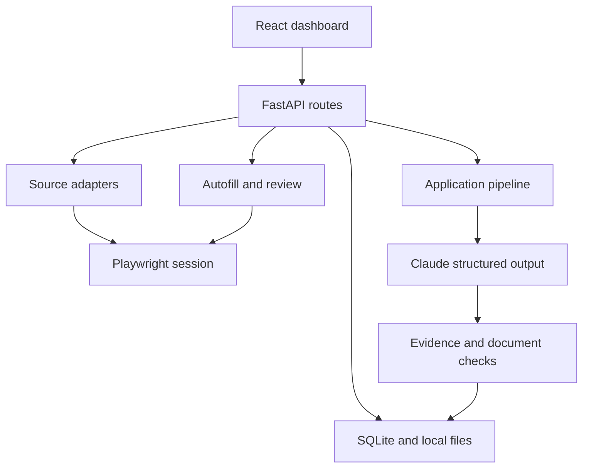

# JobApplyAI

**A local job-search workspace with AI-assisted resume tailoring and human-reviewed applications.**

JobApplyAI brings job discovery, candidate profiles, resume preparation, browser-assisted form filling, and application tracking into one React dashboard. A FastAPI backend coordinates source adapters, Claude, document validation, and a persistent browser session; SQLite stores the workflow state.

## What it does

- **Discover and organize jobs:** import a posting URL, sync supported company career boards, or read search results through a signed-in browser session.
- **Maintain a verified profile:** import resume details, review conflicts, and confirm suggested skills before using them in applications.
- **Tailor application documents:** select and reword material from a master resume, check claims against source evidence, and validate the rendered document.
- **Review job fit:** inspect a deterministic match score, keyword coverage, and missing requirements. Scores are local heuristics, not employer ATS scores or hiring predictions.
- **Assist with forms:** fill supported fields, attach documents where possible, and report unresolved inputs. The candidate reviews and submits the application.
- **Track outcomes:** record application status and export an Excel workbook with Applications, Summary, and Jobs Discovered sheets.

## Stack

| Layer | Technologies |
| --- | --- |
| Dashboard | React, Vite, Axios, Lucide |
| API and validation | FastAPI, Pydantic |
| Persistence | SQLAlchemy, SQLite |
| AI | Anthropic SDK, structured outputs, schema validation |
| Source extraction | HTTPX, Beautiful Soup, Playwright |
| Documents and exports | pdfplumber, python-docx, ReportLab, openpyxl |
| Verification | Python unittest, local Playwright fixtures, Node test runner, Oxlint, GitHub Actions |

## Quick start

Use **Python 3.12** and **Node.js 24**. The application runs on your computer; AI generation requires your own Anthropic API key and incurs API usage charges. Chrome or Edge can be used for visible browser sessions. Playwright Chromium is also supported.

### Windows (PowerShell)

From the repository root:

```powershell
py -3.12 -m venv .venv
.\.venv\Scripts\python.exe -m pip install -r backend\requirements.txt
.\.venv\Scripts\python.exe -m playwright install chromium
Set-Location frontend
npm ci
Set-Location ..
.\Start-JobApplyAI.cmd
```

The launcher opens separate backend and frontend terminals. Close both to stop the app. Subsequent launches only need `Start-JobApplyAI.cmd`.

### macOS / Linux

From the repository root:

```sh
python3.12 -m venv .venv
.venv/bin/python -m pip install -r backend/requirements.txt
.venv/bin/python -m playwright install chromium
cd frontend
npm ci
cd ..
.venv/bin/python -m uvicorn app.main:app --app-dir backend --host 127.0.0.1 --port 8000
```

In another terminal:

```sh
cd frontend
npm run dev -- --host 127.0.0.1 --port 5173 --strictPort
```

On Linux, missing Chromium system dependencies can be installed with `python -m playwright install --with-deps chromium` using the virtual environment. Interactive browser features require a graphical desktop.

| Service | Address |
| --- | --- |
| Dashboard | http://127.0.0.1:5173 |
| API documentation | http://127.0.0.1:8000/docs |
| Health check | http://127.0.0.1:8000/health |

Keep the API bound to `127.0.0.1`: it is designed for one local user and does not implement authentication.

## First application

1. Open **Settings**, add your Anthropic API key, choose a model available to your account, and use **Test API key**. You can also provide `ANTHROPIC_API_KEY` in the backend process environment. An `.env` file is not loaded automatically.
2. Open **Profile**, import your resume or enter your details, review the extracted information, and save.
3. In **Resumes**, upload and select your master resume. Profile import and master-document selection serve different purposes: the profile supplies facts; the master supplies the document to tailor.
4. In **Sources**, add a supported company career page or a single posting URL. Browser sources require a manual sign-in in the app's browser window. Select **Sync jobs** to refresh sources.
5. In **Jobs**, select **Apply**, check the posting description, and generate or select a resume. If the source only returned a listing or sign-in page, paste the full description first.
6. Review the documents and match report, then open the employer form. Review autofill results, complete unresolved questions, and submit on the employer's site yourself.
7. Mark the application as submitted in JobApplyAI. Use **Excel** to download the tracker. Edits made in Excel are not imported back into the app.

Discovery from supported public feeds and tracking can work without an AI key. Resume parsing, tailoring, answer drafting, and some generic posting imports use Claude.

## Platform support and limits

Support depends on the employer's form and the current site layout. These are implemented capabilities, not a guarantee that every live posting works.

| Platform | Discovery | Assisted application filling |
| --- | --- | --- |
| Workday | Career-board adapter | Dedicated handling for repeating experience and education sections |
| Greenhouse, Lever, Ashby | Public board adapters | Generic form and document-upload handling |
| Workable, SmartRecruiters, Recruitee | Public board adapters | Best effort through generic form handling |
| LinkedIn | Signed-in browser search | Easy Apply workflow is not implemented |
| Indeed | Signed-in browser search | Partial support; manual navigation may be needed |
| Handshake | Signed-in browser search | Listing discovery; follow the employer link to apply |
| Other posting URLs | Generic extraction where readable | Best effort; unsupported fields stay unresolved |

Sites may require login, rate-limit requests, change markup, or omit posting dates. Unknown dates remain unknown. Browser automation does not bypass verification challenges.

Agreement auto-acceptance is **off by default**, but an explicit setting exists. Some authorization answers can be filled when confirmed and applicable; factual disclosures and sensitive questions have additional restrictions. Review the actual form, including its agreements, before submission.

## Architecture



The shared tailoring pipeline handles both application packages and standalone resume generation. AI proposes document changes; deterministic checks validate evidence, coverage, and layout before returning a result. Profile revisions prevent stale edits from silently overwriting a newer profile.

See [architecture and tradeoffs](docs/architecture.md) for the module map and known engineering limits.

## Development

With the Python virtual environment active:

```sh
cd backend
python -m unittest discover -s tests -v
cd ../frontend
npm run lint
npm test
npm run build
```

Tests cover profile conflicts, source/date parsing, document selection, evidence protection, field matching, browser-action guards, and workflow behavior. Browser fixtures use local HTML and require Playwright Chromium. AI calls in regression tests are mocked; passing tests do not establish live-site compatibility or real-model output quality.

GitHub Actions runs the backend suite, frontend tests, lint, and build. See [contributing](CONTRIBUTING.md) for change guidelines.

## Configuration and data

| Setting or path | Purpose |
| --- | --- |
| `ANTHROPIC_API_KEY` | Backend environment fallback when no key is saved in Settings |
| `backend/settings.json` | Local preferences and optional API key; ignored by Git |
| `frontend/.env.local` | Optional `VITE_API_BASE_URL`; see `.env.example` |
| `backend/data/` | SQLite database, imported resumes, generated documents |
| `backend/browser-profiles/` | Persistent browser login sessions |
| `backend/exports/` | Downloadable tracker workbooks |

Application state stays on disk, but AI features send relevant content to Anthropic and browser features interact with external sites. Files are not encrypted by this app. Back up local data with the application stopped, and keep backups outside Git. See [security and data handling](SECURITY.md).

## Troubleshooting

- **Backend will not start:** confirm Python 3.12 and install `backend/requirements.txt` into the repository's `.venv`.
- **Dashboard cannot reach the API:** open `/health`, check the backend terminal, and verify the configured port. A database failure returns HTTP 503.
- **Browser will not open:** install Playwright Chromium or choose an installed Chrome/Edge under Settings. Close the previous app-controlled browser before changing channels.
- **Generation fails:** test the API key, verify model access, select a master resume, and check that the job description contains the actual posting.
- **Form is incomplete:** inspect the unresolved-field report, complete missing values manually, and use the current-page autofill action where supported. Always verify uploaded documents on the employer page.
